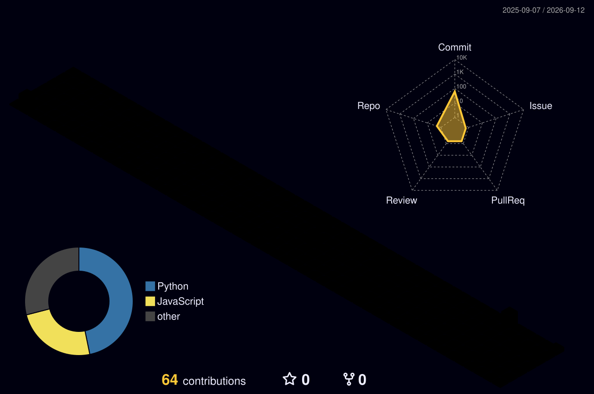

# 👋 Hi there, I'm Rohan Burra!

Building production-grade agentic AI systems with LangChain, LangGraph, and FastAPI.
Final year CS student at SRMIS — open to AI/ML engineering collabs.

---

## 🚀 About Me

- 🤖 Building multi-agent LLM systems with LangChain & LangGraph
- ☁️ Deploying on AWS with Docker, GitHub Actions CI/CD & Prometheus monitoring
- 🔗 Completed MCP Advanced Topics — Anthropic (Apr 2026)
- 🌱 Exploring agentic AI architectures and cloud-native ML deployment
- 🤝 Open to collabs on AI/ML and agentic systems

---

## 🛠️ Tech Stack

| Category | Tools |
|----------|-------|
| **AI/ML** | LangChain · LangGraph · FastAPI · TensorFlow · PyTorch · Scikit-Learn |
| **Languages** | Python · JavaScript · HTML/CSS |
| **Cloud** | AWS · Google Cloud Platform |
| **Infra** | Docker · GitHub Actions · Prometheus |
| **Databases** | MySQL · PostgreSQL |

---

## 📊 GitHub Stats

## 🌌 3D Contribution Graph

---

## 🌐 Connect with Me

